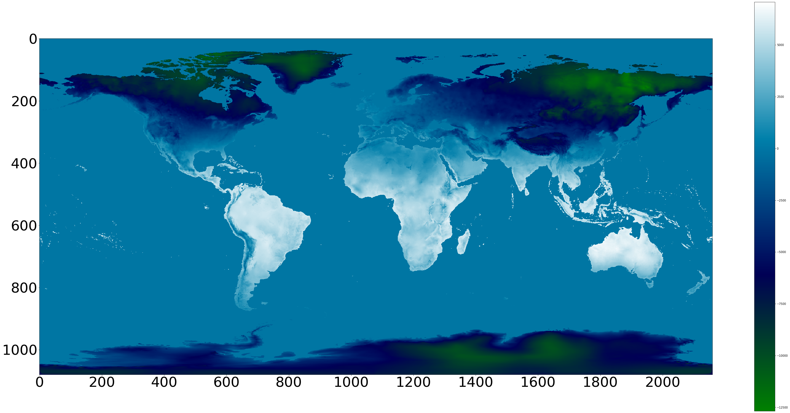

# Weather-Data
Here we visualise the minimum temperature of every place on earth for each month between the year 1970-2000 and store them in a txt file in a dictionary format --> Month_name(x,y)=temperature. where x,y are the coordinates of desired place on 1080 * 2160 world map as shown in the following image and temperature denotes the minimum temperature at that place during that month between 1970-2000.

Example for one image.

Input tiff file for jan from the folder "original tiff file" :-

 

Processed Image representing the visualisation:-

Now we can easily visualise the minimum temperature per month for the year 1970-2000 similarly for all the other images.

To extract the value of particular co-ordinate on the above image, we can look for it in the respective "Jan.txt" in Monthly Txt Files.

Source of original images : https://www.worldclim.org/data/worldclim21.html#
Spatial Resolution of Images :  10 minutes (~340 km2)

For the complete project with code for each month, look in the HistoricalWeather.ipnyb notebook.
